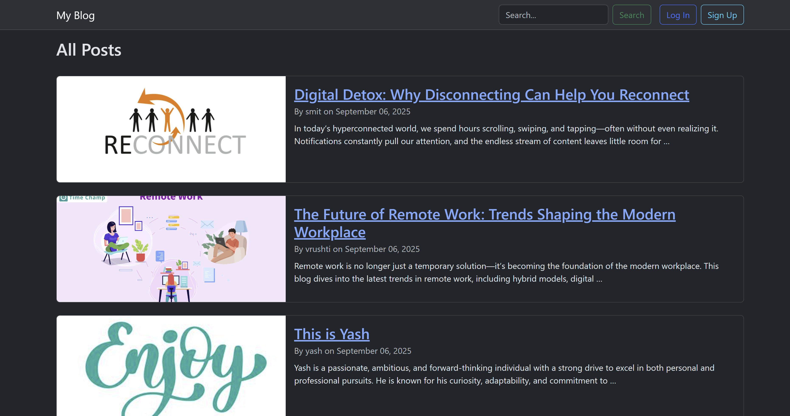
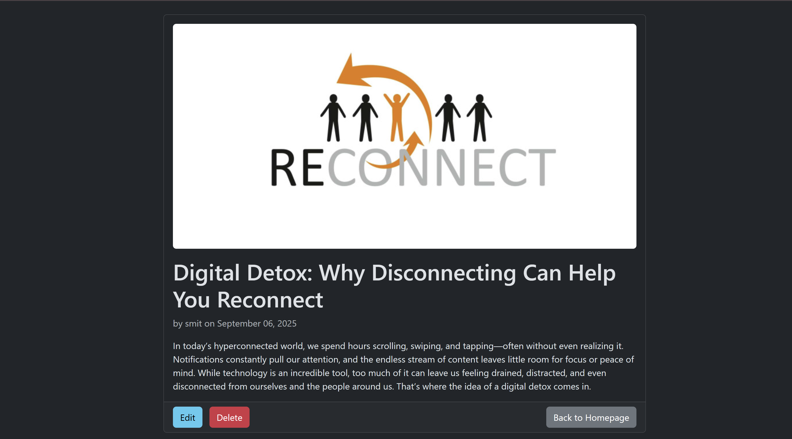
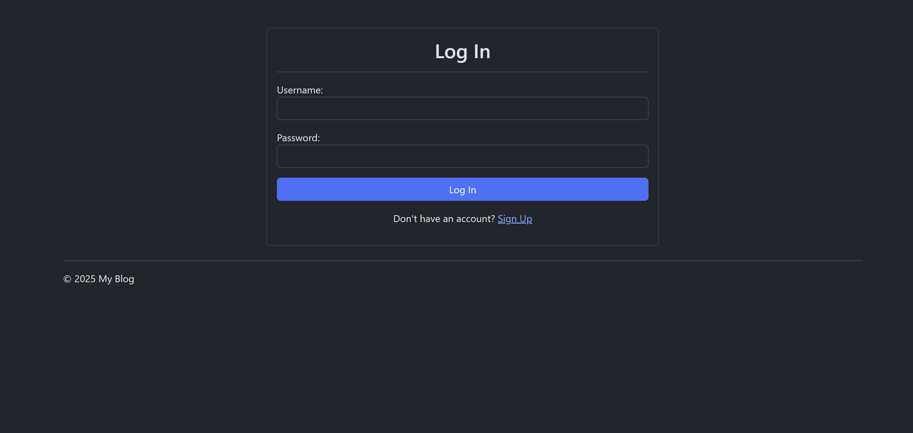
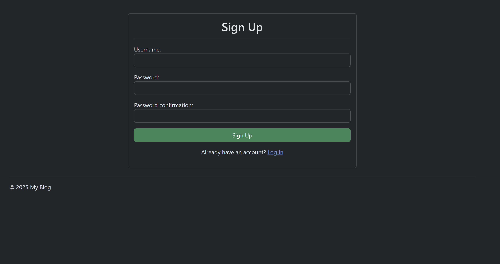
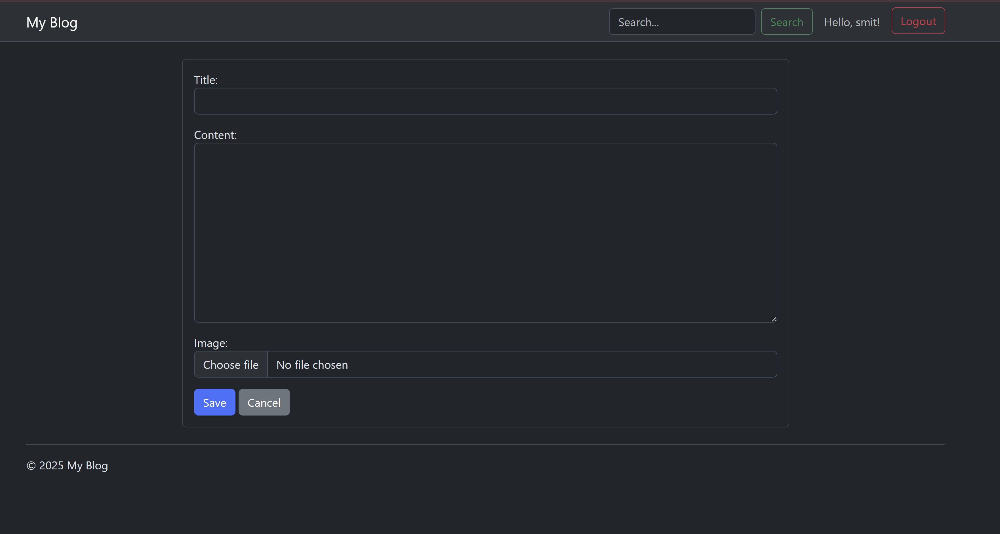

# Django Blog Project

A complete blog application built with Django, featuring full CRUD functionality, user authentication, and a responsive, dark-themed interface styled with Bootstrap. This project was built to demonstrate core Django and professional web development practices.

## Features Implemented

* **Full CRUD:** Users can Create, Read, Update, and Delete blog posts.
* **User Authentication:** Full signup, login, and logout system.
* **Permissions:** Only the author of a post can edit or delete it.
* **Image Uploads:** Users can upload a featured image for each post.
* **Search:** A search bar in the navbar filters posts by title or content.
* **Pagination:** The homepage is paginated to handle a large number of posts.
* **Styling:** A clean, responsive dark theme using Bootstrap and custom CSS.

##screenshots

**Homepage**

**Post Detail Page**

**Login Form**

**Signup Form**

**Create/Edit Post Form**

## How to Run Locally

1.  Clone the repository.
2.  Create and activate a virtual environment: `python -m venv .venv`
3.  Install dependencies: `pip install -r requirements.txt`
4.  Run database migrations: `python manage.py migrate`	
5.  Create a superuser to access the admin: `python manage.py createsuperuser`
6.  Run the development server: `python manage.py runserver`